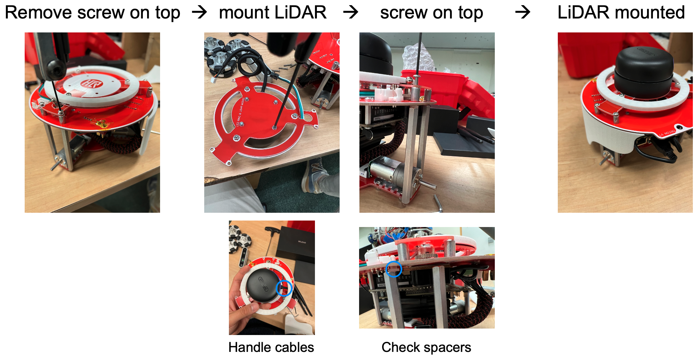

<p align="center"> 
  
</p>
<h1 align="center"> Triton </h1>
<h3 align="center"> A setup guide for the ultimate educational mobile robot platform </h3>  

</br>

<!-- TABLE OF CONTENTS -->
<h2 id="table-of-contents"> :book: Table of Contents</h2>

<details open="open">
  <summary>Table of Contents</summary>
  <ol>
    <li><a href="#about-triton"> ➤ About Triton</a></li>
    <li><a href="#prerequisites"> ➤ Prerequisites</a></li>
    <li>
      <a href="#setup"> ➤ Setup</a>
      <ul>
        <li><a href="#hardware">Hardware Setup</a></li>
        <li><a href="#software">Software Setup</a></li>
      </ul>
    </li>
    <li><a href="#references"> ➤ References</a></li>
    <li><a href="#todo-list"> ➤ TODO list</a></li>
  </ol>
</details>


<!-- ABOUT TRITON -->
<h2 id="about-triton"> :robot: About Triton</h2>

<p align="center">
          
</p>

<p align="justify"> 
  This manual serves to present the educational mobile robot, Triton, which has been developed by the <a href="https://hcr.cs.umass.edu/">Human-Centered Robotics Lab</a>. Triton is specifically designed to function as a mobile robot development platform for the <a href="https://hcr.cs.umass.edu/courses/compsci603/">COMPSCI 603 Robotics course</a>.

  The Triton robot embodies exceptional capabilities for facilitating research in the domains of robot learning, perception, and autonomous navigation. Triton is a 3-wheeled omnidirectional robot which includes a micro controller board (Arduino Mega), a powerful computing board (NVIDIA Jetson Nano), and multiple sensors (LiDAR, RGB-D camera).
</p>


<!-- PREREQUISITES -->
<h2 id="prerequisites"> :fork_and_knife: Prerequisites</h2>

The following tool will be used for your project:
* Docker

  Docker is a software platform that allows you to build, test, and deploy applications quickly. Docker packages software into standardized units called containers that have everything the software needs to run including libraries, system tools, code, and runtime. Using Docker, you can quickly deploy and scale applications into any environment and know your code will run.

  Docker works by providing a standard way to run your code. Docker is an operating system for containers. Similar to how a virtual machine virtualizes (removes the need to directly manage) server hardware, containers virtualize the operating system of a server. Docker is installed on each server and provides simple commands you can use to build, start, or stop containers. You can take a look at existing <a href="https://docker-curriculum.com/">tutorials</a> to familiarize yourself.


<!-- SETUP -->
<h2 id="setup"> :hammer: Setup</h2>

<p align="justify"> 
  The guide will help you to setup your hardware and software environment for further development in the Triton robot.
  
  * <b>Hardware Setup</b>: carefully follow the steps to build your robot hardware. 
  * <b>Software Setup</b>: familiarize yourself with docker and setup your docker environment.
  


<!-- HARDWARE -->
<h2 id="hardware"> :diamond_shape_with_a_dot_inside: Hardware Setup</h2>
<p align="justify"> 

### Components

  Check if you have all the components as in the image.
  <p align="center">
            
  </p>

### Charging battery

  A LiPo battery (3.3A, 14.8V) is used for the power source of Triton. We can charge the battery with charger included in the starter box as shown below. Details can be found in the [Tips-Triton-Basics](https://umass-my.sharepoint.com/:v:/r/personal/hochulhwang_umass_edu/Documents/Triton/Hardware/Tips-Triton-Basics.mp4?csf=1&web=1&e=FIZ5t4) video.
  <p align="center">
            
  </p>

### Assembly

  1. We will first mount the RPLiDAR on top of the robot. You will need to loosen the six screws on top of the robot with a 1/16" hex key. <b>Be careful not to lose the small spacers</b> that are on top of the pillars on the side. Connect the LiDAR to the Jetson board through the USB converter. Refer to the image below:  
  <p align="center">
            
  </p>

  2. We will now slide in the battery on the rear side of the robot and connect the battery cable to the power board. Make sure that the battery is charged. 

  3. Attach the white 3D printed plastic cover pieces unto the side of the robot. You can adjust the tightness using the hex key.  

  4. Mount the RealSense camera to the body using the USB right angle cable and set screw. Connect the other side of the cable to the Jetson board similar to the image below. 
  <p align="center">
            
  </p>

  5. Attach the three wheels on the using the hex key and set screws included in the box. Slide the wheels into the motor and tighten the set screws to attach the wheels to the robot. 

  6. Turn on the robot using the switch on top of the robot. The LED on your robot will light on. There are several other LED indicators (voltage convertor, Jetson board, Arduino) that will light on (see the Tips-Triton-Basics video to check the locations). We can now check the connectivity and see if the robot in assembled properly. 

### Check connectivity
  
  We will type in commands in the Jetson Nano board to check if our assembly is done properly.
  1. Place your robot somewhere safe (e.g., on the ground).

  2. Plug in a HDMI cable to a monitor, a keyboard, and a mouse to the Jetson. You will be able to see a screen with the Human-Centered Robotics Lab's logo. The password is <b>*triton*</b>.

  3. Open a terminal and run roscore:
  ``` bash
  roscore
  ```

  4. Open another terminal and rosrun stingray_camera. The robot's LED will turn green.
  ``` bash
  rosrun stingray_camera init.py
  ```

  5. Open the third terminal and rostopic the following command:
  ``` bash
  rostopic pub /triton06/drive_cmd geometry_msgs/Pose2d “{x: 0.0, y: 0.0, theta: 10.0}” -1
  ``` 

  6. Your Triton is expected to rotate while having the motors to spin. We completed the connectivity check and your assembly is complete!
  <p align="center"> 
  
  </p>


<!-- SOFTWARE -->
<h2 id="software"> :large_orange_diamond: Software Setup</h2>

The base Jetson supports Ubuntu <b>18.04</b> and only has ROS <b>Melodic</b>. In order to run ROS Noetic on the Jetson board, you need to run the shared docker images. We will go through on how to setup the environment in this section.

<p align="justify"> 
  
### Working remotely

  We do not need to have physical connection with the robot to write code into the robot. If you have access to a remote PC connected to the same network with the robot, you can directly *ssh* to the robot with the command `ssh triton@<IP-address>`. Take a look at other commands that are useful for transferring data: *rsync*, *scp*, *tar*, *zip*, *unzip*.

  It is possible to use Visual Studio Code (VSCode) from your remote PC to directly edit files on the triton robot using the Remote-SSH extension. The extension tunnels over SSH and you must set your `~/.ssh/config file` to let VSCode know the triton robot’s IP address. Please check [vscode remote](https://code.visualstudio.com/docs/remote/ssh) and [vscode ssh](https://code.visualstudio.com/docs/remote/ssh-tutorial) for further details.

  It can be inconvenient to create multiple virtual terminals within your docker. The *tmux* package can be useful for maintaining multiple terminals without worrying about disconnection or termination. Take a look at the [tutorial](https://github.com/tmux/tmux/wiki/Getting-Started) for details.

### ROS networking
  We can visualize the ROS networking as the diagram below. We assume that both the triton robot and your remote PC are connected to the same local network (via WiFi or ethernet) having the IP addresses: triton robot (<b>192.168.0.30</b>), remote PC (<b>192.168.0.45</b>). You need to modify the address settings depending on your actual IP addresses assigned on your network​.
  
  To enable communication on ROS between the remote PC and the triton robot, it is important to set the *ROS_MASTER_URI* environment variable of the remote PC to the IP address of the triton robot and the ROS port <b>11311</b>. ​The additional environment variable *ROS_IP* helps the triton robot and the remote PC to discover each other on the network. This can be set on both the remote PC and triton robot as shown in the diagram. On the remote PC, you can run `export ROS_IP=192.168.0.45` and `export ROS_MASTER_URI=http://192.168.0.30:11311` on bash (terminal). Add these commands to your `~/.bashrc` to automatically set this everytime you open your terminal. You can edit the *bashrc* by using the commands `vim ~/.bashrc` or `gedit ~/.bashrc`.
  
  <p align="center"> 
    
  </p>

### Working with Docker

  We will first setup the config file to easily build a docker container and then load a docker image. We will then build the docker environment (container).

  1. Create a directory that contains the docker image (e.g., triton_noetic_arm64.tar.gz) and the config file (e.g., docker-compose.yaml). You can find docker images and config files [here](https://umass-my.sharepoint.com/:f:/r/personal/hochulhwang_umass_edu/Documents/Triton/Software/Docker/Docker-Images?csf=1&web=1&e=oI6T1U). The config file enables us to build a docker container in a more managable and convenient way (run docker-compose up).
  
  2. Set the environment variables by adding the *environment* field in the config file as shown below. 

  3. You can mount volumes (e.g., utilize your local directories) to the docker container by adding the *volumes* field in the config file. For example, we mount the child directory named `files` (`${PWD}/files`) to the docker container (`/files`) in the sample config file shown below. We also mount the directory `rospackage` to the docker container at `/catkin_ws/src/rospackage`. ​If you prefer to copy files instead of mounting volumes, you can use the command `docker cp <src_path> <container_id>:<dest_path>` (e.g., `docker cp files c1e94410eedc:/files`). Use the command `docker ps` to check the *container_id*. ​

  4. Load the docker image using the compressed file from the directory we just created (this may take some time). Check if the image is loaded by the command: `docker image list`.
  ``` bash
  run docker load –input triton_noetic_arm64.tar.gz
  ```  

  5. Before builing the docker container, verify if *docker-compose* is installed on your system with the command `which docker-compose`. Take a look at the [instructions](https://collabnix.com/running-docker-compose-on-nvidia-jetson-nano-in-5-minutes/) if it is not installed. If *docker-compose* is still not accessible after following the installation steps, make sure that `$HOME/.local/bin` is in your `PATH`. You can add this to you path by adding the following line to your `~/.bashrc`.
  ``` bash
  export PATH=~/.local/bin:$PATH
  ```

  6. Run the docker container. 
  ``` bash
  docker-compose up
  ```

  7. You can now follow the steps in the [Tips-Docker-Basics](https://umass-my.sharepoint.com/:v:/r/personal/hochulhwang_umass_edu/Documents/Triton/Software/Docker/Materials/Tips-Docker-Basics.mp4?csf=1&web=1&e=FRZ69b) video to learn how to interact with the ROS topics.

  8. Stop the docker container.
  Exit from the docker container by pressing *CTRL+C*.

  * Additional notes
    * If you see any errors such as `The requested device is NOT found` or `Device 1/1 failed with exception: failed to set power state`, just stop the docker-compose with CTRL+C and run docker-compose up again​.
    * To open a terminal within the docker container, execute the bash command `docker-compose exec triton_noetic bash` inside the directory containing the `docker-compose.yaml` config file​.
    * Inside the bash terminal, you can directly run commands such as *apt*, *pip*, *wget*, *git clone*, etc. ​
    * If an ubuntu command is not available (e.g., *vim*), you can install it directly with `apt install vim`. ​
​
</p>


<!-- REFERENCES -->
<h2 id="references"> :books: References</h2>

Related docker files and instruction materials can be found in the course [OneDrive](https://umass-my.sharepoint.com/:f:/r/personal/hochulhwang_umass_edu/Documents/Triton?csf=1&web=1&e=XBpr8N) having the following structure 

    Triton
    .
    │
    ├── Hardware
    │   ├── Tips-Triton-Assembly.pptx
    │   └── Tips-Triton-Basics.mp4
    │   
    ├── Software
    │   ├── Docker
    │   │   ├── Docker-Images
    │   │   │   ├── Basic
    |   │   │   ├── accel Pytorch-CUDA
    │   │   │   └── Omni-Robot-master.zip
    |   |   |
    │   │   └── Materials
    │   │       ├── Tips-Docker-Basics.mp4
    │   │       ├── Tips-Docker-Basics.pptx
    │   │       ├── Tips-Docker-Compose.pdf
    │   │       └── Tips-Triton-SLAM.pdf
    |   |
    │   └── ROS
    |       ├── flip_camera_image.txt
    |       └── teleop_twist_keyboard.tar.gz
    |
    └── README.md


<!-- ISSUES -->
<h2 id="todo-list"> :scroll: TODO list</h2>

- [ ] Build stable cuda-aware docker image.
- [ ] Enable [Hector SLAM](https://umass-my.sharepoint.com/:b:/r/personal/hochulhwang_umass_edu/Documents/Triton/Software/Docker/Materials/Tips-Triton-SLAM.pdf?csf=1&web=1&e=fPxoOK).


✤ <i>This page supports the course <a href="https://hcr.cs.umass.edu/courses/compsci603/">COMPSCI 603 - Robotics</a>, at <a href="https://www.umass.edu/">University of Massachusetts Amherst</a><i>
